# 控制流还原完整说明

本文档根据 `说明.txt` 生成，目标是将控制流平坦化代码还原为可读、可维护的结构化代码。  
文档中的每一条规则都配有 GitHub 可渲染的 Mermaid 流程图。

## 一、预处理成 switch 节点

### 1. ifelse / 逻辑表达式 转 switch case 节点

将 `if-else`、逻辑表达式分发、嵌套条件分发统一改写为 `switch(pc)` 形式，为后续节点图分析建立统一输入格式。

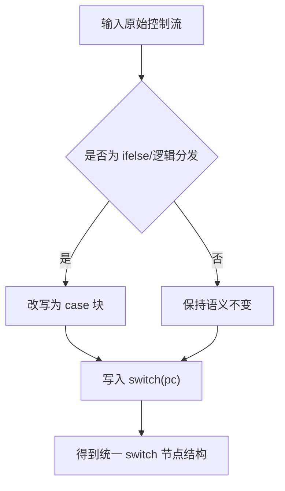

### 2. 每个 switch 节点后加 break

每个 `case` 块末尾补齐 `break`，避免 case 穿透影响图边关系判断。

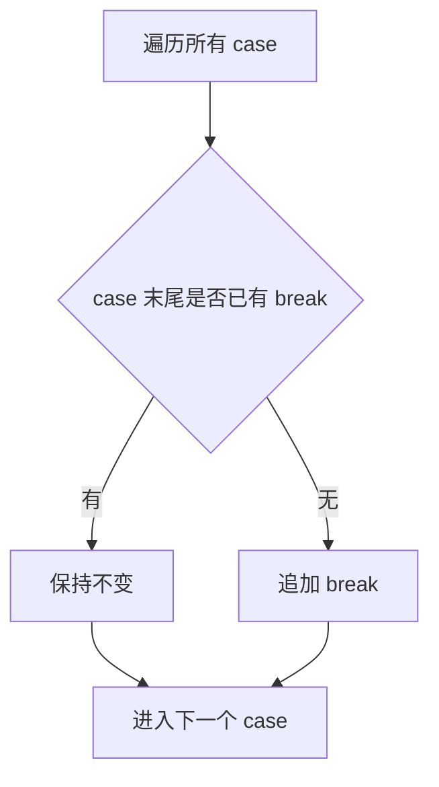

### 3. 终止语句不是 return 的改为 return

如 `pc = 0` 等“退出驱动循环”语句，在预处理阶段统一归一为 `return`（示例：`pc=0` 改为 `return;`）。

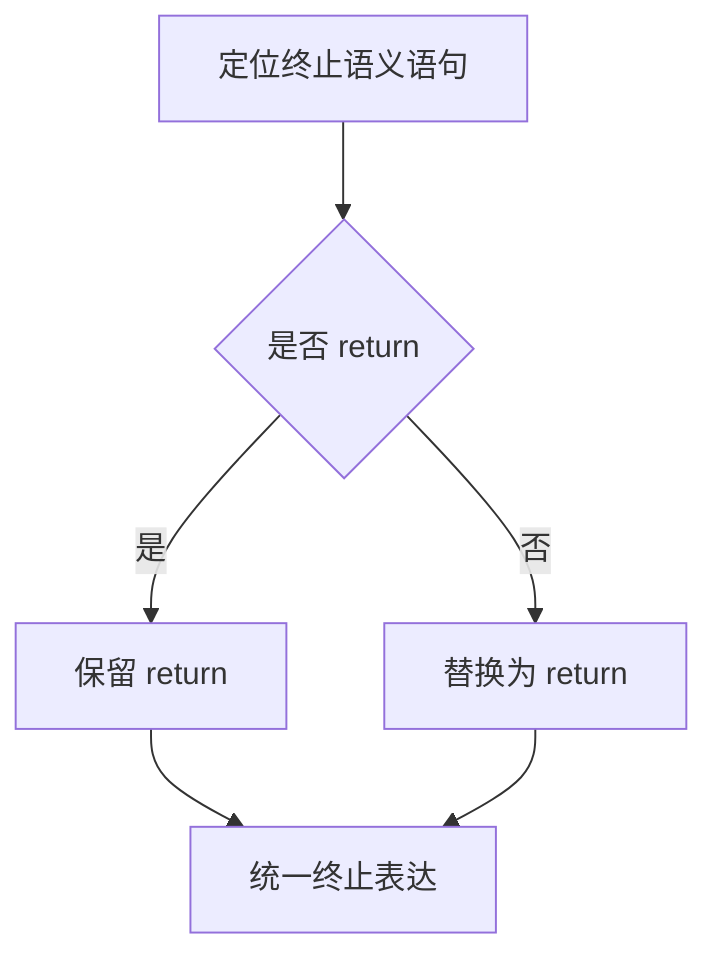

## 二、switch 节点 case 块处理成三种节点类型

为了实现控制流的还原（即节点合并算法），我们首先需要对 `switch` 下的 `case` 节点进行严格的特征分类。以如下典型的平坦化代码为例：

## 样本代码

```javascript
for (var i, pc = 6; pc;) switch (pc) {
    case 1:// 单向节点
        i = 0;
        pc = 4;
        break;
    case 2:// 单向节点
        console.log(i);
        pc = 7;
        break;
    case 3:// 终止节点
        console.log("end");
        pc = 0; // pc为0时, 即退出循环，即为return；可将pc=0;改为return;
        break;
    case 4:// 分支节点
        pc = i < 6 ? 2 : 3;
        break;
    case 5:// 单向节点
        pc = 4;
        break;
    case 6:// 单向节点
        console.log("start");
        pc = 1;
        break;
    case 7:// 单向节点
        i++;
        pc = 5;
        break;
}
```

根据上述代码，我们将控制流节点严格划分为以下三种类型。注意：只有严格符合对应AST结构和语句特征的 case 块，才能被判定为该类型。
1. 单向节点 (One-way Node)
严格定义与特征：
语句构成：可以包含任意数量（0个或多个）的其他普通业务语句。
状态转移：在 case 块的最后，必须是对控制流指针 pc 的单一常量赋值（形如 pc = 常量;）。
结尾特征：必须严格以 break; 语句作为该 case 的结尾。
符合该类型的 Case：case 1, case 2, case 5, case 6, case 7。
节点流程图：
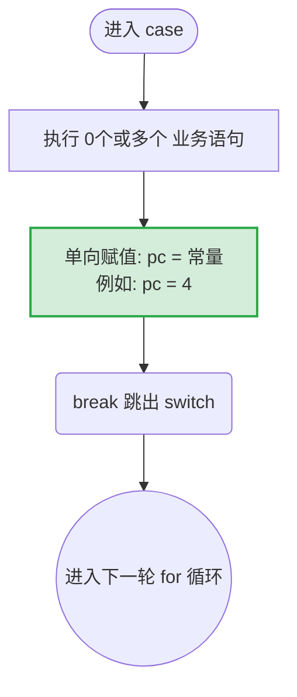
2. 分支节点 (Branching Node)
严格定义与特征：
语句构成：该 case 块内部绝对不允许包含任何其他业务语句。
状态转移：仅允许包含一条严格的三元运算赋值语句，根据条件将 pc 指向两个不同的常量（形如 pc = 条件 ? 常量1 : 常量2;）。
结尾特征：必须严格以 break; 语句作为该 case 的结尾。
符合该类型的 Case：case 4。
节点流程图：
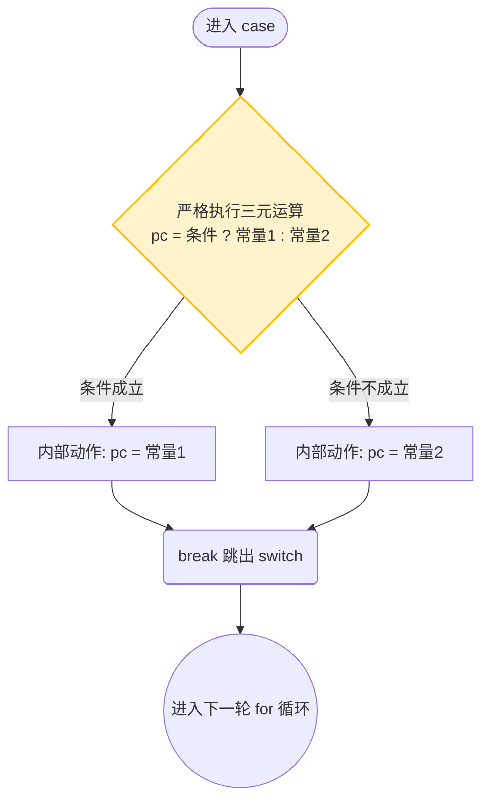
3. 终止节点 (Terminal Node)
严格定义与特征：
语句构成：同单向节点，可以包含任意数量（0个或多个）的最后阶段的业务语句。
状态转移：在 case 块的最后，必须将控制流指针 pc 赋值为导致外层循环退出的值（形如 pc = 0;）。也可以直接使用 return; 退出函数，则替代赋值语句。
结尾特征：通过 pc = 0 或return语句。退出时必须严格以 break 语句结尾。
符合该类型的 Case：case 3。
节点流程图：
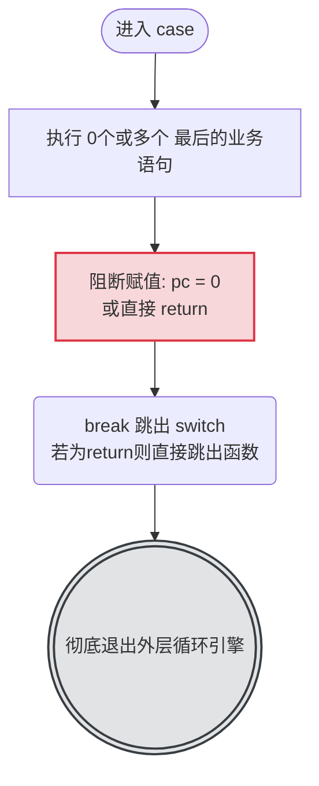
节点合并算法总结
在进行 AST (抽象语法树) 还原时，必须先通过脚本遍历所有的 SwitchCase 节点，运用上述严格的判定条件给每个 case 打上类型标签。
遇到 单向节点，意味着可以将下一个目标 case 的代码直接吸收到当前节点之后。
遇到 分支节点，则意味着控制流在此分叉，需要构建一个 IfStatement 或 WhileStatement 节点，并将两个目标常量对应的 case 代码分别填入分支结构中。
遇到 终止节点，表示当前执行路径到达尽头，控制流分析闭环。
严格遵守这三种节点结构的定义，是确保还原算法不出错、不遗漏业务代码的核心基础。

## 三、处理虚假分支

### 1. 识别虚假分支

示例：

```javascript
case 1:
    pc = (1+2===3) ? 16:20; // pc = 20 永远不会被执行，即虚假分支
    break;
```

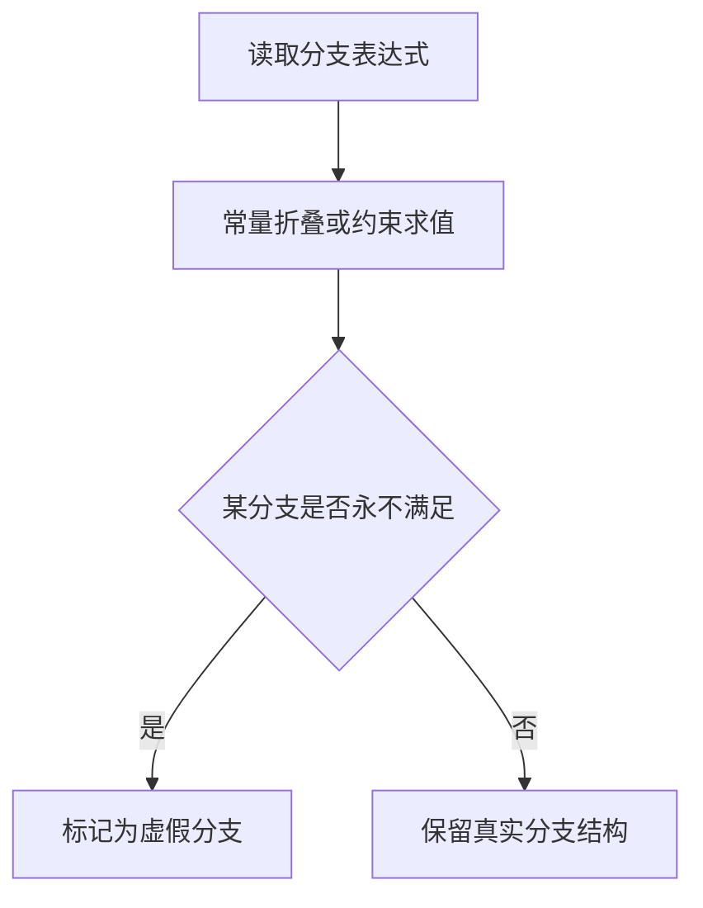

### 2. 将虚假分支改为单向节点

改写目标：

```javascript
case 1:
    1+2===3; // 根据实际情况判断是否保留条件判断语句
    pc = 16; // 改为单向节点
    break;
```

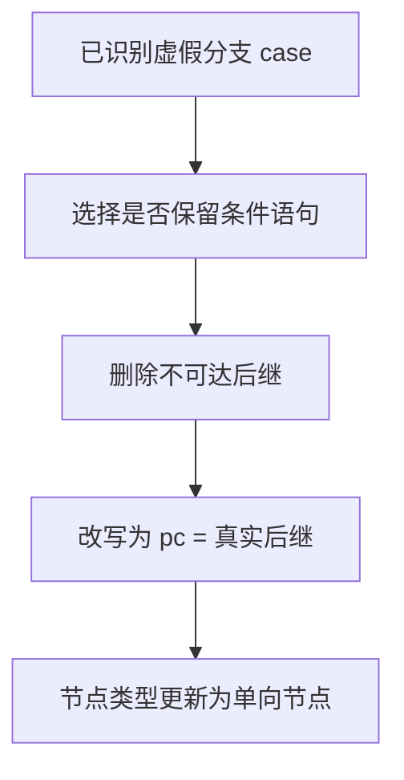

### 3. 分析方式：静态分析 + 动态分析

流程要求：
- 浏览器插桩 dump 所有执行到的 case；
- 多次执行后合并，降低随机因子导致的误判。

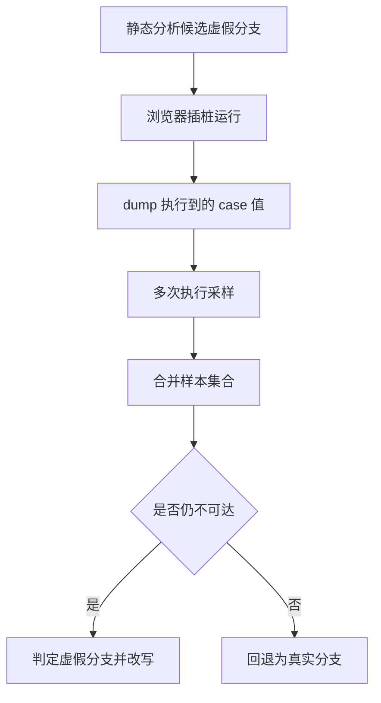

## 四、删除永远不会被执行到的 case 块（游离节点）

依据动态执行得到的 case 集合，保留已执行节点，删除未执行节点。

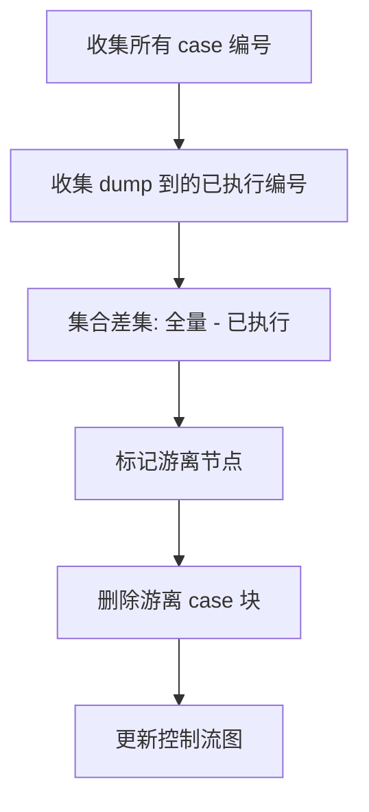

## 五、合并单向节点（规则）

### 规则 1：后继是终止节点

当前单向节点后继为终止节点，则合并后结果为新的终止节点。

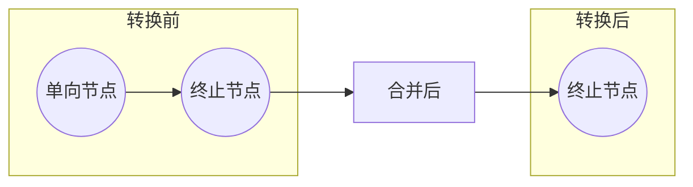

### 规则 2：后继是自身节点

当前单向节点后继指向自己，合并为 `while true` 循环，结果为新的终止节点。

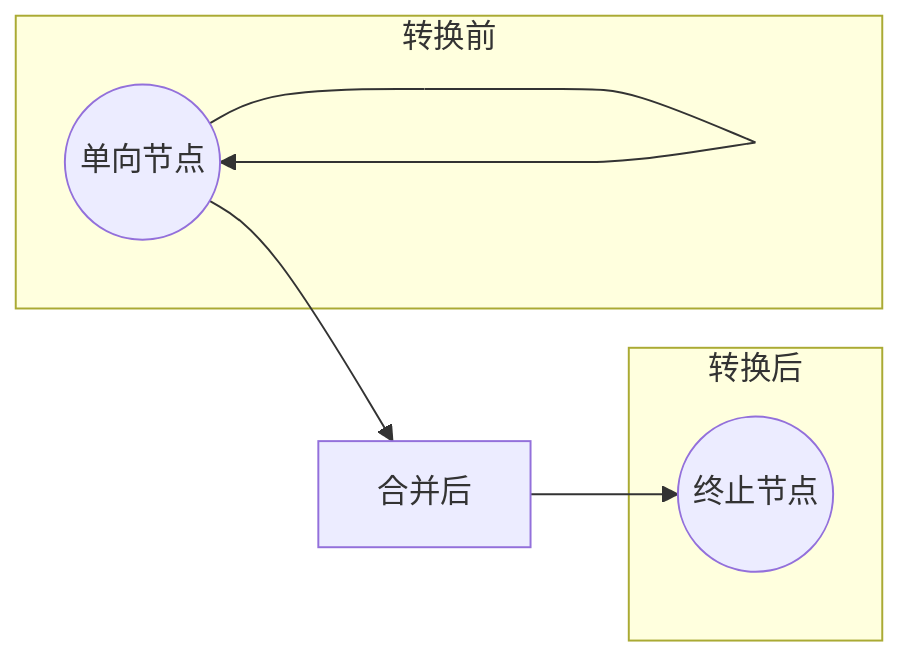

### 规则 3：后继是单向节点

当前单向节点后继仍是单向节点，持续合并并递归直到命中规则 1 或规则 2。

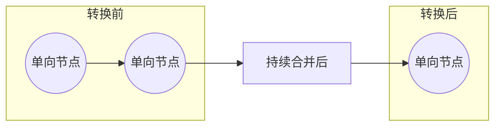

## 六、合并分支节点（规则）

### 规则 1：一个分支不存在对应 case

将当前分支节点退化为单向节点（指向存在的分支）。

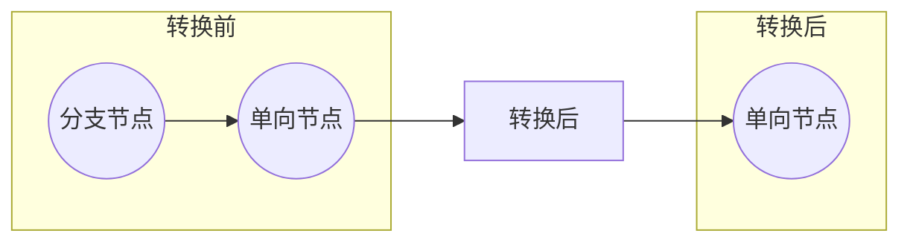

### 规则 2：一个分支后继等于另一个分支

转换为 `if`：该分支后继作为 `if body`，另一个分支作为新的后继，节点改为单向节点。

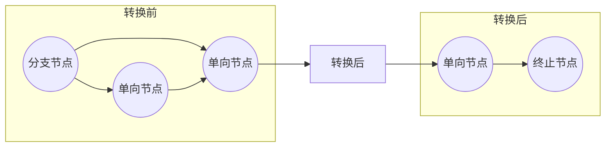

### 规则 3：两个分支后继相同

构造成 `ifelse` 后合并共同后继，节点改为新的单向节点。

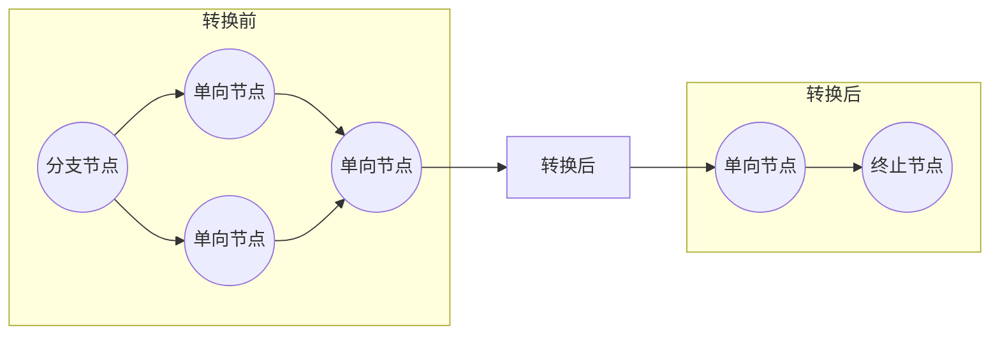

### 规则 4：两个分支都是终止节点

构造成 `ifelse`，并将当前节点转换为终止节点。

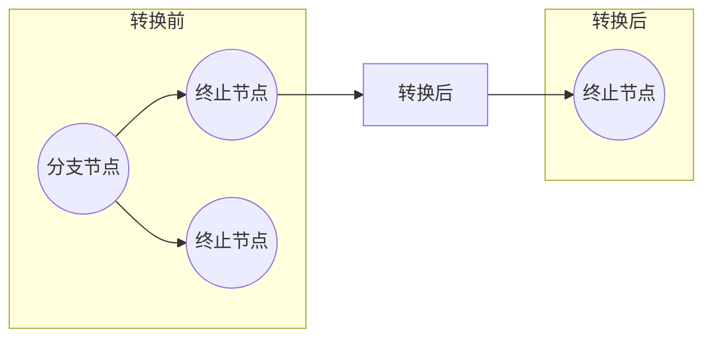

### 规则 5：一个分支回指当前节点，另一个分支是终止节点

合并为 `while(条件)`，循环后追加另一终止节点，结果为新的终止节点。

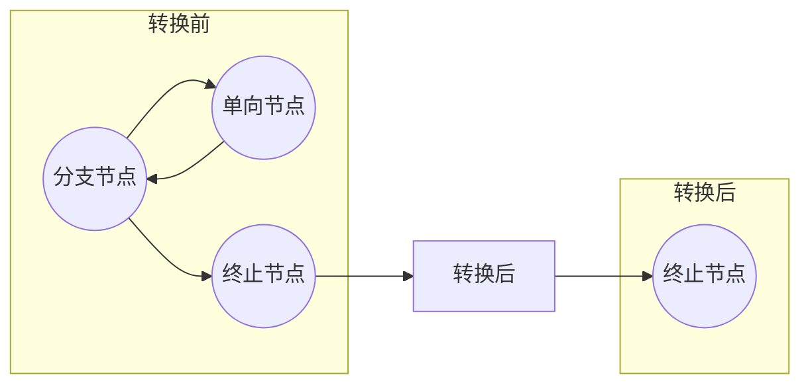

### 规则 6：一个分支回指当前节点，另一个分支是单向节点

合并为 `while(条件)`，循环后追加单向节点，结果为新的单向节点。

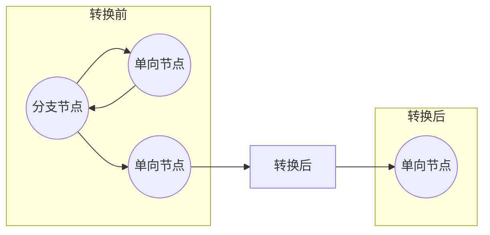

### 规则 7：一个分支是终止节点，另一个分支是单向节点

转换成 `if` 结构：终止分支作为 `if body`，后接单向节点，结果为新的单向节点。

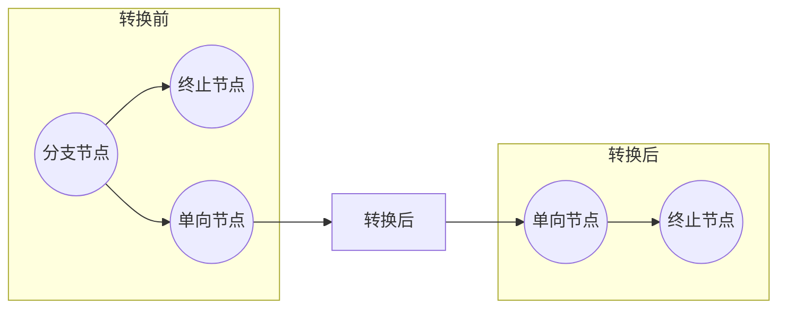

## 七、递归执行上述合并操作

持续执行“单向合并规则 + 分支合并规则”，直到图收敛，最终所有节点都转换成终止节点，合并完成。

```mermaid
flowchart TD
  A["初始化节点图"] --> B["执行单向节点合并"]
  B --> C["执行分支节点合并"]
  C --> D{"本轮是否有变化"}
  D -->|有| B
  D -->|无| E["图收敛"]
  E --> F["所有路径归并为终止节点"]
  F --> G["控制流还原完成"]
```

## 附：实施顺序总览

```mermaid
flowchart LR
  A["预处理 switch"] --> B["三类节点分类"]
  B --> C["处理虚假分支"]
  C --> D["删除游离节点"]
  D --> E["合并单向节点"]
  E --> F["合并分支节点"]
  F --> G["递归迭代直至收敛"]
  G --> H["输出结构化代码"]
```
